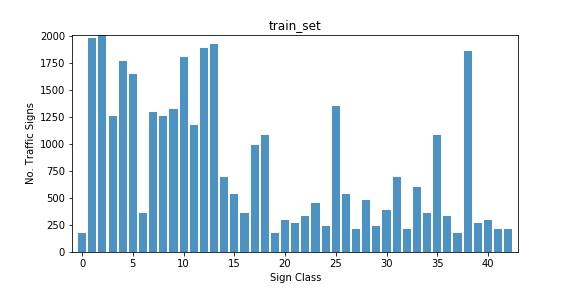

#**Project 2:Traffic Sign Recognition** 

### Project goal
The goal of this project is to train a deep neural network with a subset of Germany traffic sign images, containing 43 sign classes. The trained network is further applied to 8 images found from websites,  to predict the traffic signs.

### Data Set Summary & Exploration
####1. Statistic summary of the data set [2nd code cell]
The data comes into 3 sets, training set, validation set and testing set. The basic statistics about the data set are summarized below. 

* The size of training set is 34799
* The size of test set is 12630
* The shape of a traffic sign image is 32x32x3
* The number of unique classes/labels in the data set is 43

####2. visualization of the dataset [3rd code cell]
In order to better understand the traffic sign images, the very first image of each individual class in training set is visualized with class labels and sample counts, as below. 

It can be seen that the images have a few apprearance variances, including scale, zoom, exposure, light condition, orientation, background and etc. This will raise challanges to sign recognition. 
In addition, the sample counts for each classes in training set are also plotted in a histogram. The sample counts are distributed unequally with a minimum of 180 images and a maximum of 2010 samples. Such uneven distribution may have some impact to network training. 

###Design and Test a Model Architecture

####1. Data preprocessing [4th code cell]

Based on a [paper authored by Sermanet & LeCunk](http://yann.lecun.com/exdb/publis/pdf/sermanet-ijcnn-11.pdf), gray scale images are sufficient for reliable recognition, while reducing the computation complexity significantly. So in the first step, colour images are converted to gray scale ones, with formula `Y = 0.299 * R + 0.587 * G + 0.114 * B`. The following figure visiualizes the first images of each class in training set after gray scale conversion. 

in the second step, grayscale images are normalized to between 0.0 and 1.0. Two normalization methods are evaluated, One is a simple image-wise normalization to convert value from 0-255 to 0-1.0 linearly. Another one is doing localized histogram equalization with function `exposure.equalize_adapthist()` in library `skimage`. Localized histogram equalization provides better performance in later experiments, since it highlights local curves/edges. This method is adopted for data preprocessing. The first images of each class in training set after localized histogram equalization is plotted below:

Gray scale convertion and localized histogram equalization are applied to training set, validation set, as well as testing set. 

####2. Training data augmentation [5th code cell]

In addition to preprocessing, jittered images based on original ones (grayscale and normalized) are created for training set. The original images are randomly perturbed in vertical/horizontal position (+/-2 pixels), in scale ([.9, 1.1] ratio), rotation (+/-15 degrees), and shearing (+/-10 degree). The function `keras.preprocessing.image.ImageDataGenerator` is used to produce perturbed images. For each class, 4000 images combining both original and perturbed ones are used as the new training set. In total, the training set has `4000x43 = 172000` images in total and distributed evenly across classes after augmentation. The perturbed image and even distribution in classes will help prevent overfitting, as shown in later experiments. The images sample for each class in training set after augmentation is plotted below. It can be seen clearly that the signs have random rotations and position shift, compared to original images. 
                

####3. Training  and validation data split [6th code cell]
To cross validate my model, I randomly split the training data into a training set and validation set. I did this by function `sklearn.model_selection.train_test_split()`, and set 80% of augmented images as training set, and 20% of that as validation set.

####4. Model architecture [8th code cell]

LeNet is adopted and modified for the neural network model, contains two convolution (5x5x1) layers, and two fully connected hidden layers, and one output layer. Maxpooling with stride of 2 is used after each convolution layer. Dropout features are inserted for both convolution layers, and both fully connected hidden layers. My final model consisted of the following layers:

| Layer         		|     Description	        					| 
|:---------------------:|:---------------------------------------------:| 
| Input         		| 32x32x1 grayscale image   							| 
| Convolution 5x5     	| 1x1 stride, valid padding, outputs 28x28x6 	|
| RELU					|												|
| Max pooling	      	| 2x2 stride,  outputs 14x14x6 				|
| Convolution 5x5     	| 1x1 stride, valid padding, outputs 10x10x16 	|
| RELU					|												|
| Max pooling	      	| 2x2 stride,  outputs 5x5x16 				|
| Fully connected		| outputs 400x120  |
|								RELU					|												|
| Fully connected		| outputs 120x84  |
| 									RELU					|												|
| Fully connected		| outputs 84x43  |
| Softmax				|        									|

####5. Model training [9th code cell] 

According to [an overview of gradient descent optimization algorithms](http://sebastianruder.com/optimizing-gradient-descent/), Adam optimizer provides good convergence rate, which is used in this training. Other parameters includes `batch size = 128`, `epochs = 25`, and `learning rate = 0.002` 

####6. Training results discussion [10th code cell] 

During model training, for each epoch, both training accuracy and validation accuracy are recorded. For comparison purpose, four experiments are conducted, by choosing training set (original set vs. augmented set) and turning dropout on/off. The training results are summarized below. 

| Accuracy |     Original, no dropout	| Original, dropout	| Augmented, no dropout	| Augmented, dropout      					| 
|:----------------:|:-----------------:| :-----------------:|:-----------------:|:-----------------:| 
| training        | 0.999	| 0.997 | 0.987| 0.973|
| validation    | 0.963	| 0.966 | 0.968 |0.975|
| testing 	      | n/a	|n/a  | n/a| 0.953|

With original training set and without dropout, validation accuracy is the lowest, although training accuracy is the highest (0.999), indicating model overfitting. While it is shown that both training set augmentation and dropout help prevent model overfitting, and improve validation accuracy. 

With augmented training set and dropout, validation accuracy is comparable to training accuracy. Now the modeling accuracy is probably limited by model itself, instead of parameters overfitting. Training accuracy and validation accuracy with at each epoch are plotted below. 

In summary, my final model has the results below.

* training set accuracy of 97.3%
* validation set accuracy of 97.5%
* test set accuracy of 95.3%

###Test a Model on New Images

####1. Traffic signs from web and resizing [14th code cell]

Here are 8 German traffic signs that I found on the web

The raw images were cropped to make the signs sitting in center. Since the images vary in size, they are resized to be 32x32 before being converted to gray scale and normalized.

####2. Model prediction [15th code cell]

The original traffic signs with predicted labels are shown below:

The model was able to correctly guess 7 of the 8 traffic signs, which gives an accuracy of 87.5%. This compares favorably to the accuracy on the test set of 95.3%. The incorrect prediction is on image #6 (a truck inside a red cycle). The predicted label and probability for each image is summarized in the table below:

|#| Sign in Image	        |     Prediction	        		| Probability 	     |
|:-:|:---------------------:|:---------------------------------------------:|:---------------------:| 
|1| Yield				| Yield						|1.0		|
|2| 30 km/h	      		| Speed limit (30km/h)			|0.997876|
|3| 70 km/h	      		| Speed limit (70km/h)			|1.0		|
|4| Double curve	      	| Double curve				|0.999761|
|5| Road work		      	| Road work					|0.987192|
|6| Vehicles over 3.5 metric tons prohibited| No passing [X]	|0.39281	|
|7| Stop Sign      		| Stop Sign  	  				|0.999991| 
|8| Keep right    			| Keep right					|0.999882|

####3. Further analysis [16th code cell]

For these signs being predicted correctly, the prediction probability are quite high (above 98%), indicating high level prediction confidence. While for image #6, which is incorrectely predicted, the probability for top 1 prediction is only 39%. I further printed out top 5 predictions with softmax probability for each image. The top 5 prediction pie-chart for image #6 is shown below. 

Interestingly, the correct answer for this sign ('Vehicles over 3.5 metric tons prohibited') is ranked the 3rd place with a probability of 10.0%. All top 5 predictions are all have red cycle surrounding in the images, and the only differences are the content inside the cycle. It seems that the model recognize the red cycle correctly, but failed to identify the shape inside. It may be due to the fairly low resolution of this image. 

### Summary

In this project, a modified LeNet is built and trained with traffic sign images. Training set augmentation and parameters dropout are utilized to prevent overfitting. After training, the model achieves 97.5% validation accuracy, and 95.3% testing accuracy. In addition, the model is further tested with 8 traffic sign images found in web, and successfully predicts 7 signs.